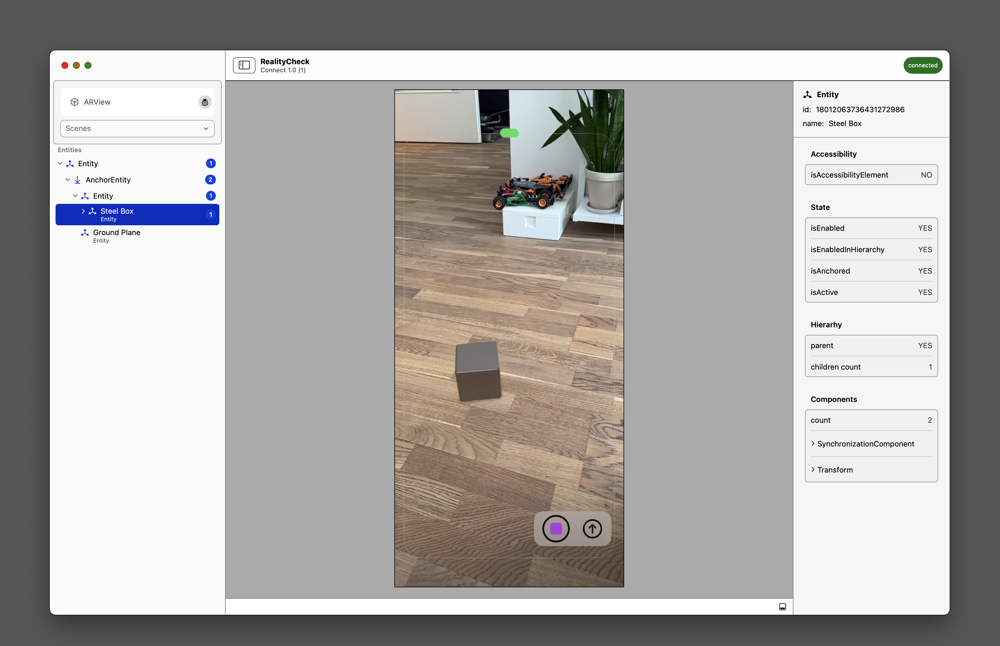

# RealityCheck

RealityCheck is an open-source Mac app designed to help AR development teams streamline their workflows and improve the quality of their projects. It provides a debugger for RealityKit, a powerful framework for building AR experiences, that allows developers to inspect the Entity Component System (ECS) structure and properties, and make changes in real-time for preview/debug purposes.

## Features

- Inspect and modify entity and component properties in real-time for debugging and preview purposes
- Stream the current state of your AR app to the RealityCheck debugger in real-time
- Support for custom representations for different types of properties, such as transform matrices and light intensity
- Built with SwiftUI and The Composable Architecture for clean, modular code and a great user experience

## Getting Started

To use RealityCheck in your AR project, you'll need to import the RealityCheck library and connect to a live session running on an iOS device. Please refer to the [Documentation](https://github.com/monstar-lab/reality-check/docs) for detailed instructions on how to integrate RealityCheck into your project.

## Contributing

We welcome contributions from the AR development community! If you'd like to contribute to RealityCheck, please see our [Contributing Guidelines](https://github.com/monstar-lab/reality-check/CONTRIBUTING.md) for instructions on how to get started.

## License

RealityCheck is released under the [MIT License](https://github.com/monstar-lab/reality-check/LICENSE).

## Contact

If you have any questions or feedback about RealityCheck, please contact us at [email address]. We'd love to hear from you!

That's just a rough example, but I hope it gives you an idea of what to include in your README. Let me know if you have any questions or need any further assistance!
